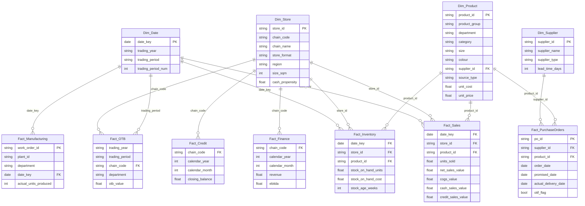

# Data model — Meridian Apparel Group Power BI dashboard

A star schema built for an apparel **manufacturer + multi-chain retailer**: three
chains (a department-store banner, a value banner, and a kids specialist), two
owned manufacturing plants, plus external suppliers. The sample data in
`../data/csv/` is generated by `../data/generate_sample_data.py` and matches
this schema exactly, so you can load it into Power BI and start building
immediately.

## Why this shape

Everything asked for in the brief — store performance, sales/sqm, stock turn,
sell-through, markdown alerts, OTB, OTIF, supplier and product performance,
plus finance/credit/manufacturing — is a **measure over one of three grains**:
sales transactions, inventory snapshots, and planning/ops events (POs, OTB,
work orders, GL). A conformed `Dim_Date` and shared `Dim_Store` / `Dim_Product`
/ `Dim_Supplier` let every one of those grains slice consistently by chain,
department/category, and trading period — that's the whole point of a star
schema here: one filter context, every KPI.

## Entity-relationship diagram



## Tables

### Dimensions

| Table | Grain | Key columns | Notes |
|---|---|---|---|
| `Dim_Date` | one row per trading week | `date_key` (PK, week-start Monday) | `trading_year` / `trading_period` (13 x 4-week periods) is the "trading period" grouping the brief asks for; `calendar_month`/`quarter`/`year` cover calendar-based reporting. Mark as **Date table** in Power BI (`date_key`, type Date). |
| `Dim_Store` | one row per store | `store_id` (PK) | `chain_code`/`chain_name` is the "chain" slicer; `size_sqm` drives sales-per-sqm; `cash_propensity` seeds the cash/credit split (a store attribute, not a measure input — the real split lives in `Fact_Sales`). |
| `Dim_Product` | one row per SKU | `product_id` (PK), `supplier_id` (FK) | `product_group` > `department` > `category` is the hierarchy for "Group, Department, Category" product performance. `source_type` (Own Manufacture / External) links retail sell-through back to the manufacturing plants. |
| `Dim_Supplier` | one row per supplier | `supplier_id` (PK) | Includes the two internal plants (`supplier_type = "Internal Manufacturing"`) so OTIF and supplier-performance visuals can compare make vs. buy. |

### Facts

| Table | Grain | Key measures feed | Relationship notes |
|---|---|---|---|
| `Fact_Sales` | store x product x trading week | Turnover, basket, cash/credit split, sales/sqm, sell-through, product performance | Many-to-one to `Dim_Date`/`Dim_Store`/`Dim_Product` on single-direction filters. `cash_sales_value`/`credit_sales_value` and `cash_transactions`/`credit_transactions` are pre-split so basket and tender-mix measures don't need transaction-line detail. |
| `Fact_Inventory` | store x product x trading week (snapshot) | Stock turn, sell-through denominator, aged-stock/markdown alerts | Same three dimension keys as `Fact_Sales`, deliberately kept as a **separate fact** (different grain semantics — a snapshot, not an additive event) rather than merged, so stock measures use `LASTDATE`/`AVERAGEX` and sales measures use `SUM` without colliding. |
| `Fact_PurchaseOrders` | one row per PO line | OTIF, supplier performance, receipt timing for OTB | Links to `Dim_Supplier` and `Dim_Product`; `order_date`/`promised_date`/`actual_delivery_date` are plain date columns (not relationships) — build measures with `DATEDIFF`, don't relate them to `Dim_Date`. |
| `Fact_OTB` | chain x department x trading period | OTB tracker | Relates to `Dim_Date` via `trading_year`+`trading_period` (composite — see below) and to `Dim_Store` via `chain_code` (create a small `Dim_Chain` bridge table if you want a clean single-column relationship; see "Composite keys" below). |
| `Fact_Manufacturing` | plant x department x trading week | OEE, output vs. plan, cost per unit, on-time work orders | Relates to `Dim_Date` on `date_key`; `plant_id` maps 1:1 to the two internal rows in `Dim_Supplier`. |
| `Fact_Finance` | chain x calendar month | P&L, EBITDA, working capital | Grain is monthly, coarser than the weekly `Dim_Date` — relate via a `Dim_Month` table (see below), not directly to `Dim_Date`. |
| `Fact_Credit` | chain x calendar month | Credit book, arrears, bad debt | Same monthly grain as `Fact_Finance`; can share `Dim_Month`. |

## Composite / cross-grain keys — how to wire it in Power BI

Power BI relationships are single-column. Two tables here need a bridge:

1. **`Fact_OTB` (trading_year + trading_period) → `Dim_Date`.**
   Add a calculated column in `Dim_Date`:
   `TradingPeriodKey = [trading_year] & "-" & [trading_period]`
   and the same concatenation in `Fact_OTB`, then relate on that column
   (many-to-one, `Fact_OTB` → a `Dim_TradingPeriod` table you get by
   `SELECTCOLUMNS(DISTINCT(...))` off `Dim_Date`, marked non-Date-table).
   Keep `Dim_Date` itself as the one true Date table for everything else.

2. **`Fact_Finance` / `Fact_Credit` (calendar_year + calendar_month) → monthly rollups.**
   Add `MonthKey = [calendar_year] & "-" & FORMAT([calendar_month], "00")` to
   both fact tables and to a small `Dim_Month` table derived from `Dim_Date`
   (`SUMMARIZE(Dim_Date, Dim_Date[calendar_year], Dim_Date[calendar_month])`
   plus the same `MonthKey` column). Relate `Fact_Finance`/`Fact_Credit` to
   `Dim_Month` many-to-one; relate `Dim_Month` to `Dim_Date` is **not**
   needed — instead put month/quarter/year slicers on `Dim_Month` for the
   Finance/Credit pages, and on `Dim_Date` for everything else.

3. **`Dim_Store.chain_code` used directly on `Fact_OTB`, `Fact_Finance`, `Fact_Credit`.**
   These three facts are already at chain grain, so relate them straight to
   `Dim_Store` on `chain_code` (many-to-one) rather than inventing a separate
   `Dim_Chain` — Power BI is fine relating a fact to a non-key column of a
   dimension as long as it's unique on that column *per relationship*; if you
   prefer strict key hygiene, create `Dim_Chain` by
   `SELECTCOLUMNS(DISTINCT(Dim_Store), "chain_code", ..., "chain_name", ...)`
   and relate through that instead — cleaner for the visuals-by-chain that
   don't need store-level detail.

## Power Query (M) — loading each CSV

All eleven CSVs live in `../data/csv/`. In Power BI Desktop: **Get Data →
Folder**, point at that folder, then **Combine → Transform Data**, or load
each file individually with **Get Data → Text/CSV**. For each table, set
column data types explicitly (Power Query's auto-detect is usually right,
but pin these):

- `date_key`, `order_date`, `promised_date`, `actual_delivery_date`,
  `period_start`, `open_date` → **Date**
- `*_flag` columns → **True/False**
- `*_value`, `*_cost`, `*_qty`, `*_units`, `*_balance`, `*_hours` → **Decimal
  Number** (or Whole Number for the `*_qty`/`*_units` counts if you don't
  need fractional units)
- everything else (`*_id`, `*_code`, `*_name`, `department`, `category`,
  `region`, `chain_code`) → **Text**

Example M for one table (repeat per file, or use a Folder query with a
function applied to each):

```m
let
    Source = Csv.Document(File.Contents("C:\...\apparel-powerbi-dashboard\data\csv\fact_sales.csv"),
        [Delimiter=",", Columns=11, Encoding=65001, QuoteStyle=QuoteStyle.None]),
    Promoted = Table.PromoteHeaders(Source, [PromoteAllScalars=true]),
    Typed = Table.TransformColumnTypes(Promoted, {
        {"date_key", type date}, {"store_id", type text}, {"product_id", type text},
        {"units_sold", type number}, {"gross_sales_value", type number},
        {"discount_value", type number}, {"net_sales_value", type number},
        {"cogs_value", type number}, {"cash_sales_value", type number},
        {"credit_sales_value", type number}, {"cash_transactions", type number},
        {"credit_transactions", type number}
    })
in
    Typed
```

## Relationship summary (set these in Model view)

| From (many) | To (one) | Column | Direction |
|---|---|---|---|
| `Fact_Sales` | `Dim_Date` | `date_key` | Single |
| `Fact_Sales` | `Dim_Store` | `store_id` | Single |
| `Fact_Sales` | `Dim_Product` | `product_id` | Single |
| `Fact_Inventory` | `Dim_Date` | `date_key` | Single |
| `Fact_Inventory` | `Dim_Store` | `store_id` | Single |
| `Fact_Inventory` | `Dim_Product` | `product_id` | Single |
| `Fact_PurchaseOrders` | `Dim_Supplier` | `supplier_id` | Single |
| `Fact_PurchaseOrders` | `Dim_Product` | `product_id` | Single |
| `Fact_OTB` | `Dim_TradingPeriod` (derived, see above) | `TradingPeriodKey` | Single |
| `Fact_OTB` | `Dim_Store`/`Dim_Chain` | `chain_code` | Single |
| `Fact_Manufacturing` | `Dim_Date` | `date_key` | Single |
| `Fact_Manufacturing` | `Dim_Supplier` | `plant_id` = `supplier_id` | Single |
| `Fact_Finance` | `Dim_Month` (derived) | `MonthKey` | Single |
| `Fact_Finance` | `Dim_Store`/`Dim_Chain` | `chain_code` | Single |
| `Fact_Credit` | `Dim_Month` (derived) | `MonthKey` | Single |
| `Fact_Credit` | `Dim_Store`/`Dim_Chain` | `chain_code` | Single |
| `Dim_Product` | `Dim_Supplier` | `supplier_id` | Single |

The last row is what makes **"Supplier performance by sales"** work: `Fact_Sales`
and `Fact_Inventory` only carry `product_id`, so to slice sales/sell-through by
supplier the filter has to flow `Dim_Supplier` → `Dim_Product` → `Fact_Sales`.
Set this relationship's direction to single (`Dim_Product` is the many side),
same as every other dimension edge — Power BI will happily propagate the
filter two hops without needing a bidirectional relationship anywhere.

When you build `Dim_Month`, give it a real `month_start_date` (Date type, the
1st of the month) alongside `MonthKey` — the point-in-time Finance/Credit
measures (`EoP` balances, active accounts) need `LASTDATE()`/`MAX()` on an
actual date column, not a text key.

Keep **all** relationships single-direction (fact filtered by dimension), and
do not relate the fact tables to each other directly — cross-fact analysis
(e.g. "sell-through" combining `Fact_Sales` and `Fact_Inventory") happens in
DAX measures via shared dimension filters, not physical relationships.

## Sizing (sample data)

| Table | Rows |
|---|---|
| `dim_date` | 104 |
| `dim_store` | 15 |
| `dim_supplier` | 10 |
| `dim_product` | 40 |
| `fact_sales` | 62,400 |
| `fact_inventory` | 62,400 |
| `fact_purchase_orders` | 1,400 |
| `fact_otb` | 624 |
| `fact_manufacturing` | 312 |
| `fact_finance` | 72 |
| `fact_credit` | 72 |

Trivial for Power BI's in-memory VertiPaq engine — this is a realistic shape
for a mid-size apparel retailer's data volumes, scaled down for a fast-loading
demo. Swap in real extracts with the same column names and everything below
(measures, pages) keeps working unchanged.
